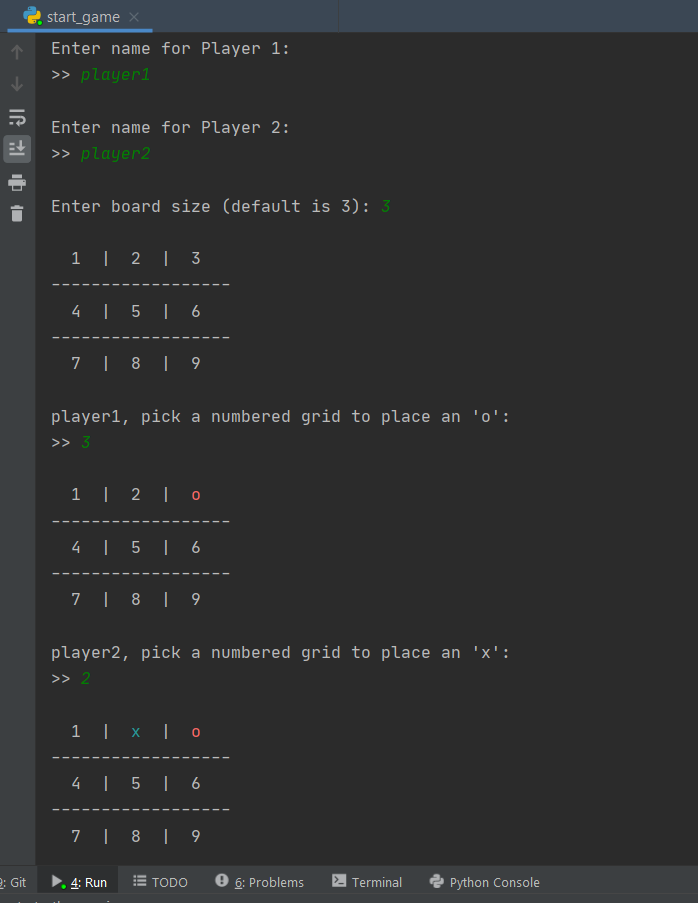

[](https://www.codacy.com/gh/chuckball/nxn-tictactoe/dashboard?utm_source=github.com&amp;utm_medium=referral&amp;utm_content=chuckball/nxn-tictactoe&amp;utm_campaign=Badge_Grade)
[](https://www.codacy.com/gh/chuckball/nxn-tictactoe/dashboard?utm_source=github.com&utm_medium=referral&utm_content=chuckball/nxn-tictactoe&utm_campaign=Badge_Coverage)
[](https://circleci.com/gh/chuckball/nxn-tictactoe)

# Installation
## Pre-Requisite
-   Python 3.7.6 or higher

## Steps
``` bash
# 1. Clone repo
git clone https://github.com/chuckball/nxn-tictactoe.git
# 2. Navigate into the cloned directory
cd nxn-tictactoe
``` 
## Play the Game
Run command to start game (python3 could be py or just python depending on your python installation)

``` bash
python3 start_game.py
``` 

## Features
-   Game board is not limited to just 3x3
-   Symbols are colored in shell

## How-to-play
-   Take turns inserting the symbols 'x' and 'o' depending on which player you are
-   Win by lining up 3 of your symbols in a row horizontally, vertically or diagonally

## Screenshot



Enjoy!

